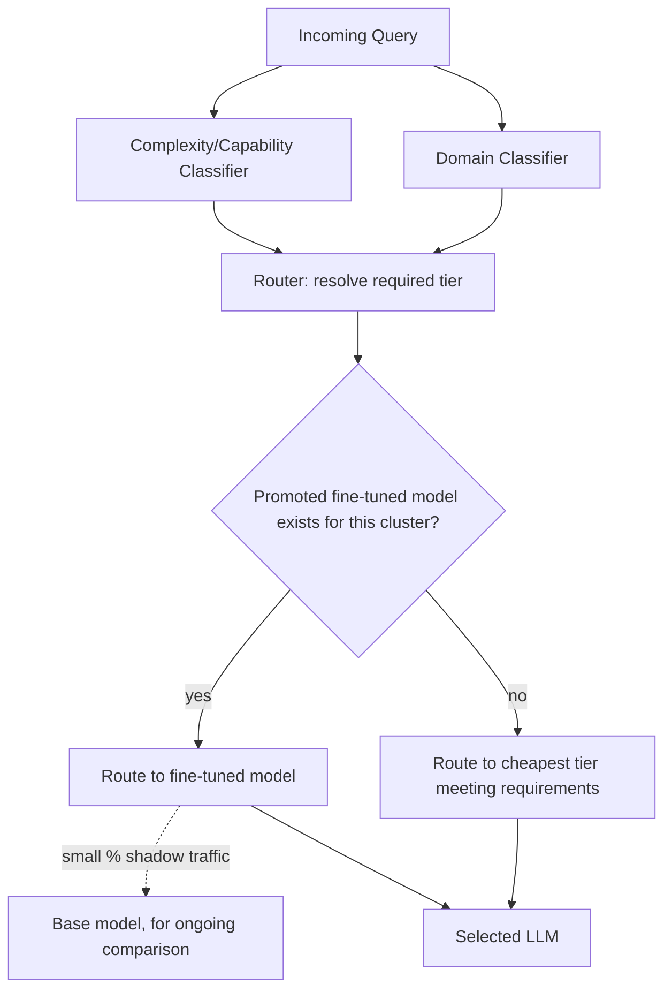

# ADR-004: Model Routing — cost, latency, capability, and domain

**Status:** Accepted
**Date:** 2026-07-02
**Note:** This ADR is the implementation spec for Task 38 (Model Router).

## Context

The Generation Subsystem must select an LLM per query rather than hard-coding a single model.
Query traffic is heterogeneous: simple factual lookups, long-context document synthesis,
code-related questions, and domain-specific (e.g. legal/medical-adjacent) queries all have
different cost/latency/quality tradeoffs. Fine-tuned models, once promoted (see architecture.md
§5), also need to enter the routing pool for the query clusters they were trained on. A single
fixed model either overspends on simple queries or underperforms on hard ones — neither is
acceptable at production scale.

## Decision

Route every query through a **router** that scores candidate models on three axes — **cost
tier**, **capability requirements**, and **domain** — and selects the cheapest model that meets
the query's capability and domain requirements, unless a fine-tuned model has been promoted for
that query's cluster (in which case the fine-tuned model is preferred, shadow-evaluated on an
ongoing basis).

Routing signals, computed per incoming query:
1. **Complexity/capability classification** — a lightweight classifier (or heuristic: query
   length, presence of code blocks, multi-hop question structure, requested output length)
   estimates whether the query needs long-context, tool-use, vision, or multi-step reasoning.
2. **Domain classification** — a lightweight classifier tags the query's domain based on the
   pipeline's configured domain and/or query content (general, code, legal/compliance, financial,
   support).
3. **Cost tier selection** — given capability + domain requirements, the router picks the
   cheapest model tier that satisfies them, from `economy` → `balanced` → `premium`.
4. **Fine-tuned override** — if a promoted fine-tuned model exists for the resolved (pipeline,
   domain, complexity-cluster) key, it is used instead of the base-tier pick, with a small
   percentage of matching traffic still shadow-routed to the base model for ongoing comparison.

### Routing matrix

| Query type | Signals | Model tier | Example model class | Why this tier wins |
|---|---|---|---|---|
| Simple factual lookup | short query, single-hop, small context window needed | **Economy** | small/fast general model (e.g. GPT-4.1-mini class) | Answer quality plateaus quickly for simple lookups; cost/latency dominate the decision. |
| Standard support/FAQ query | medium query, single document domain, moderate context | **Balanced** | mid-tier general model | Best cost/quality tradeoff for the bulk of everyday RAG traffic; this is the default tier. |
| Long-document synthesis | large context window needed (many retrieved chunks), multi-hop reasoning across chunks | **Premium** | large-context, high-reasoning model | Requires strong long-context handling and synthesis; cheaper models degrade noticeably on multi-chunk synthesis. |
| Code-related query | code blocks present, technical domain tag | **Premium (code-specialized)** | code-strong model class | Code correctness has a low error tolerance; general-purpose economy models have materially higher bug/hallucination rates on code. |
| Legal/compliance domain | domain tag = legal/compliance | **Premium** | high-reasoning, high-faithfulness model | Faithfulness matters most here (low tolerance for ungrounded claims); routed to whichever tier has the best measured `faithfulness` score for this domain, not necessarily the largest model. |
| High-traffic, narrow query cluster with a promoted fine-tuned model | matches a (pipeline, domain, cluster) with `promoted_to_router = true` | **Fine-tuned override** | fine-tuned economy/balanced base | Once proven to beat the base model on faithfulness + relevance for its cluster, it's both cheaper and better than routing that cluster to a generic premium model. |
| Vision/multi-modal query | query references an ingested image document or requests image understanding | **Premium (vision-capable)** | vision-capable model | Capability requirement — non-vision models cannot serve this query type at all, so tier selection here is a hard filter, not a cost optimization. |

### Data flow

## Consequences

**Positive:**
- Cost scales with actual query difficulty instead of a flat premium-model cost for all traffic.
- Hard capability requirements (vision, long-context) are enforced as filters, not just cost
  preferences, preventing quality failures from under-provisioning.
- Fine-tuned models get a clear, metric-gated path into production routing without a risky
  full cutover.

**Negative:**
- Misclassification (complexity or domain) can route a hard query to too cheap a model, degrading
  answer quality silently unless caught by the Evaluation Subsystem.
- Two extra classification calls (complexity, domain) add latency and cost to every query, though
  both are designed to be lightweight relative to the generation call itself.
- The routing matrix requires ongoing maintenance as new model classes become available or
  existing ones are deprecated by providers.

## Revisit trigger

Review the routing matrix whenever: a new model class becomes available that changes a tier's
cost/quality curve, or `evaluation_aggregates` shows a tier/domain combination consistently
underperforming its expected faithfulness/relevance band over a rolling 7-day window.
