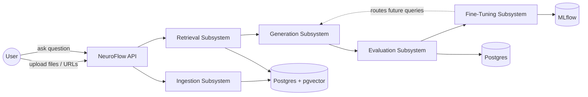
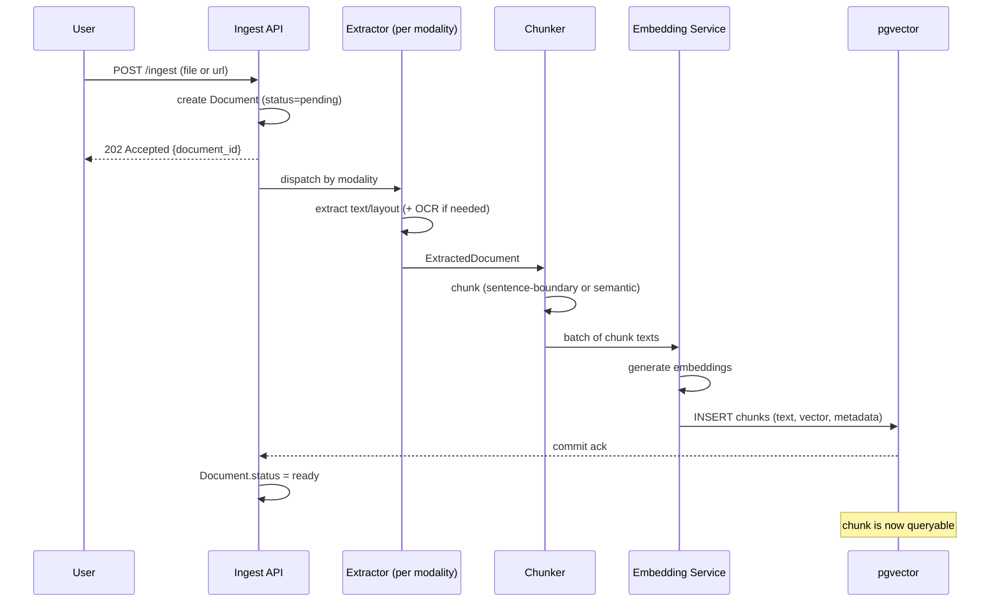
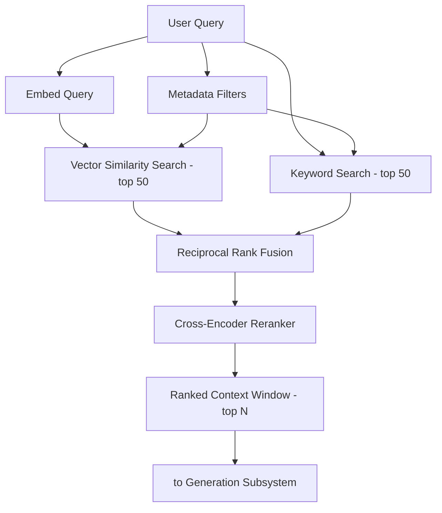
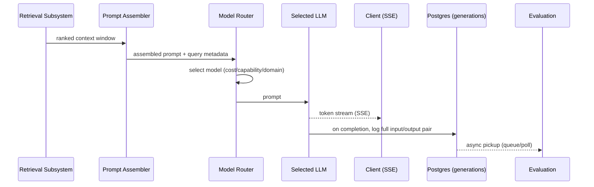
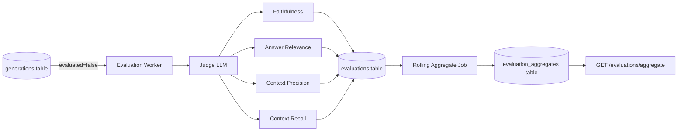
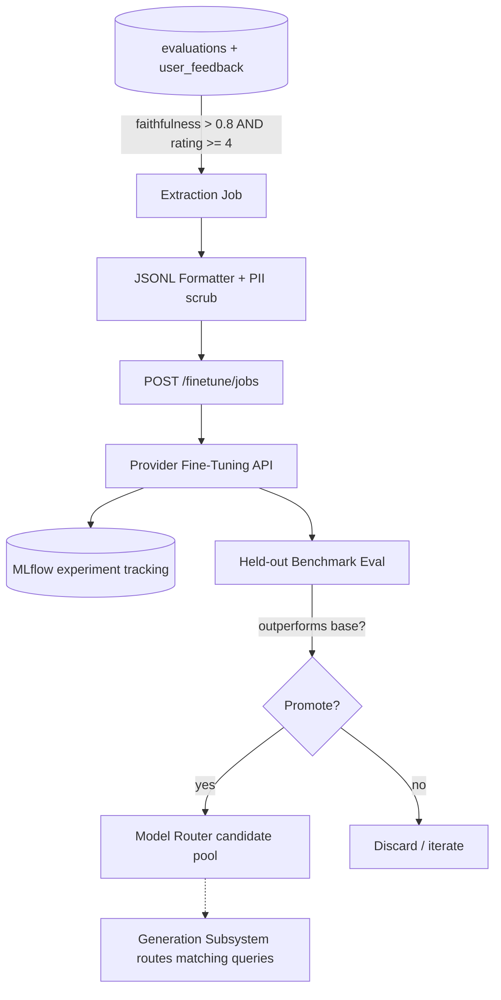

# NeuroFlow Architecture

This document defines the five core subsystems of NeuroFlow. Every subsequent implementation task
must conform to the interfaces and data flows described here. Changes to this document after
implementation begins require a new ADR.

## System context

---

## 1. Ingestion Subsystem

**Responsibility:** turn raw, heterogeneous input (PDF, DOCX, images, CSV, web URLs) into
queryable vectors with associated metadata.

### Pipeline stages

1. **Upload / intake** — `POST /ingest` accepts a file or a URL. File is written to object
   storage; a `Document` row is created in Postgres with `status = pending`.
2. **Modality detection & extraction**
   - PDF → text + layout extraction (PyMuPDF / pdfplumber), OCR fallback for scanned pages.
   - DOCX → python-docx, preserves headings for structure-aware chunking.
   - Images → OCR (Tesseract or a vision model) + optional image captioning for non-text images.
   - CSV → row-wise or schema-aware chunking, column headers retained as metadata.
   - Web URL → fetch + boilerplate removal (readability extraction), stores canonical URL as
     source metadata.
3. **Normalization** — all extractors emit a common `ExtractedDocument` shape: ordered list of
   text blocks with page/section metadata, regardless of source modality.
4. **Chunking** — see [ADR-002](adr/002-chunking-strategy.md) for strategy selection. Default:
   sentence-boundary chunking with a target size of 512 tokens and 15% overlap; switches to
   semantic chunking for long-form unstructured documents when configured.
5. **Embedding** — chunks are batched and embedded with the configured embedding model
   (default: `text-embedding-3-large`, swappable per pipeline config).
6. **Write to vector store** — chunk text, embedding vector, and metadata (`document_id`,
   `source_type`, `page`, `chunk_index`, `created_at`) are written to `pgvector` in a single
   transaction per document; `Document.status` flips to `ready` only after all chunks commit.
7. **Indexing confirmation** — the chunk becomes queryable by the Retrieval Subsystem the moment
   the transaction commits; no separate index-build step (HNSW index updates incrementally).

### Data flow: upload → first queryable vector

### Failure handling

- Extraction failures mark the document `failed` with an error reason; partial extraction (e.g.
  some pages OCR'd, others not) is allowed and flagged per-page in metadata.
  Ingestion is idempotent per `(source_hash, pipeline_config_id)` — re-ingesting an unchanged
  source is a no-op.

---

## 2. Retrieval Subsystem

**Responsibility:** given a user query, return the best possible ranked context window for
generation.

### Pipeline stages

1. **Query received** — from `POST /query`, optionally scoped by `pipeline_id` / metadata filters.
2. **Query embedding** — same embedding model used at ingestion time (per pipeline config) embeds
   the query.
3. **Parallel candidate retrieval:**
   - **Vector similarity search** — cosine similarity top-K (default K=50) against pgvector HNSW
     index.
   - **Keyword search** — Postgres full-text search (`tsvector`/`tsquery`) top-K (default K=50)
     for lexical/exact-match recall (IDs, codes, names embeddings tend to miss).
   - **Metadata filtering** — applies structured filters (`document_id`, `source_type`, date
     range, tags) as a pre-filter on both of the above, not a separate ranked list.
4. **Fusion (Reciprocal Rank Fusion)** — vector and keyword result lists are merged:
   `score(d) = Σ 1 / (k + rank_i(d))` across both lists, `k = 60` by default. Produces a single
   ranked candidate list (default top 30 after fusion).
5. **Cross-encoder reranking** — the fused candidates are reranked by a cross-encoder
   (query, chunk) relevance model (default: a `bge-reranker`-class model), producing a final
   precision-optimized ordering.
6. **Context window assembly** — top-N reranked chunks (default N=8, budget-capped by token
   limit of the target LLM) are packed into the context window, deduplicated, and returned with
   provenance (document_id, chunk_id, score) for later evaluation.

### Data flow

### Design notes

- Vector and keyword search run concurrently (not sequentially) to bound latency; RRF requires
  both lists before it can run, so total retrieval latency ≈ max(vector_latency, keyword_latency)
  + fusion + rerank.
- Reranking is the most expensive step (cross-encoder inference); candidate list is capped at 30
  post-fusion specifically to bound rerank cost.

---

## 3. Generation Subsystem

**Responsibility:** turn a context window + query into a grounded, streamed answer, and log
everything needed for evaluation.

### Pipeline stages

1. **Prompt assembly** — system prompt + ranked context chunks (with citations markers) + chat
   history (if any) + user query, assembled from a versioned prompt template.
2. **Model routing** — the router selects an LLM based on: cost tier, required capability
   (e.g. tool use, long context, vision), and domain (e.g. legal, code, general). See
   [ADR-004](adr/004-model-routing.md) for the full routing matrix. Fine-tuned models are
   included as routing candidates once they outperform base models on a given query cluster
   (see Fine-Tuning Subsystem).
3. **Streaming generation** — the response streams token-by-token over SSE
   (`GET /query/{query_id}/stream`) so the client can render incrementally.
4. **Logging** — on stream completion, the complete input/output pair (prompt, context chunk
   IDs, model used, full response text, token counts, latency, cost) is written to the
   `generations` table for the Evaluation Subsystem to pick up asynchronously.

### Data flow

### Design notes

- Generation is decoupled from evaluation: the user gets their streamed answer immediately;
  evaluation runs asynchronously and never blocks the response path.
- Every generation is logged even if the user disconnects mid-stream (server-side buffer flushes
  to DB on completion or timeout).

---

## 4. Evaluation Subsystem

**Responsibility:** asynchronously score every generation for quality, store results, and expose
rolling aggregates.

### Metrics (all LLM-as-judge, see [ADR-003](adr/003-evaluation-framework.md))

- **Faithfulness** — are the claims in the answer grounded in the retrieved context? (0–1)
- **Answer relevance** — does the answer address the actual question asked? (0–1)
- **Context precision** — of the chunks retrieved, how many were actually used/relevant to the
  answer? (0–1)
- **Context recall** — of the chunks that were relevant to the question, how many were actually
  retrieved? (0–1, requires a reference answer or ground-truth relevance set where available)

### Pipeline stages

1. **Trigger** — a background worker polls (or consumes from a queue on) new rows in
   `generations` where `evaluated = false`.
2. **Scoring** — a judge LLM (separate from the generation model, to avoid self-preference bias)
   scores each of the four metrics independently, given: the query, the retrieved context chunks,
   and the generated answer.
3. **Persistence** — scores are written to the `evaluations` table (Postgres), one row per
   generation, foreign-keyed to `generations.id`.
4. **Rolling aggregates** — a scheduled job (e.g. every 15 min) computes rolling windows (1h,
   24h, 7d) per metric, per pipeline, per model, and writes to `evaluation_aggregates` for fast
   dashboard/API reads without recomputation on every request.

### Data flow

---

## 5. Fine-Tuning Subsystem

**Responsibility:** close the loop — turn the evaluation log's best examples into fine-tuned
models, and route future traffic to them when they win.

### Pipeline stages

1. **Extraction** — a scheduled job queries `generations JOIN evaluations JOIN user_feedback`
   for rows where `faithfulness > 0.8 AND user_rating >= 4`, selecting prompt/completion pairs.
2. **Formatting** — pairs are formatted as JSONL (`{"messages": [...]}` chat format), split into
   train/validation sets, deduplicated, and PII-scrubbed.
3. **Job submission** — `POST /finetune/jobs` submits the JSONL to the provider's fine-tuning API
   (OpenAI/Anthropic/etc., abstracted behind a provider interface) against a chosen base model.
4. **Experiment tracking** — every fine-tuning run (dataset version, hyperparameters, base model,
   resulting eval metrics) is logged as an MLflow run for comparison across experiments.
5. **Evaluation-gated promotion** — once a fine-tuning job completes, the resulting model is
   evaluated on a held-out benchmark set covering the same query cluster it was trained on. It is
   only registered as a routing candidate in the Model Router (Generation Subsystem) if it
   outperforms the current base/production model on faithfulness and answer relevance.
6. **Routing** — the Model Router (see ADR-004) starts sending future queries in that cluster to
   the fine-tuned model, with a rolling comparison against the base model to catch regressions
   (shadow traffic / gradual rollout, not an instant full cutover).

### Data flow

### Design notes

- Fine-tuned models never fully replace the base model in the router — they're added as
  higher-priority candidates for the query clusters they were trained on and demonstrably win on,
  with continuous shadow evaluation to detect drift/regression.
