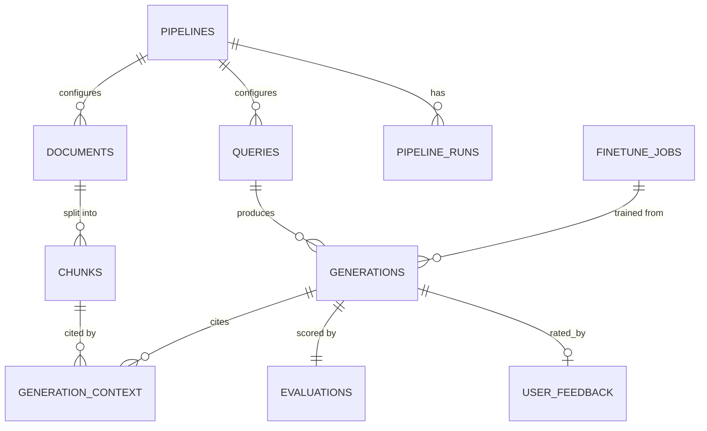

# NeuroFlow Data Models

Single Postgres instance (with the `pgvector` extension) is the system of record for all five
subsystems. This keeps joins across ingestion → retrieval → generation → evaluation → fine-tuning
cheap and consistent, at the cost of coupling storage scaling to a single engine (see
[ADR-001](adr/001-vector-store.md) for the tradeoff discussion).

## Entity relationship overview

## `pipelines`

| column | type | notes |
|---|---|---|
| `id` | text (PK) | e.g. `pipeline_abc123` |
| `name` | text (unique per workspace) | |
| `workspace_id` | text (FK) | |
| `embedding_model` | text | e.g. `text-embedding-3-large` |
| `chunking_strategy` | text | `fixed_size` \| `sentence_boundary` \| `semantic` |
| `chunk_size` | int | tokens |
| `chunk_overlap_pct` | numeric | |
| `reranker_model` | text | |
| `default_model_tier` | text | `economy` \| `balanced` \| `premium` |
| `retrieval_config` | jsonb | top_k, rrf_k, final_top_n |
| `created_at` | timestamptz | |

## `documents`

| column | type | notes |
|---|---|---|
| `id` | text (PK) | e.g. `doc_9f2a` |
| `pipeline_id` | text (FK → pipelines) | |
| `source_type` | text | `pdf` \| `docx` \| `image` \| `csv` \| `url` |
| `source_uri` | text | object storage path or URL |
| `source_hash` | text | for idempotent re-ingestion |
| `status` | text | `pending` \| `extracting` \| `chunking` \| `embedding` \| `ready` \| `failed` |
| `error_reason` | text (nullable) | |
| `metadata` | jsonb | user-supplied tags, etc. |
| `created_at` | timestamptz | |
| `ready_at` | timestamptz (nullable) | |

## `chunks`

| column | type | notes |
|---|---|---|
| `id` | text (PK) | e.g. `chk_001` |
| `document_id` | text (FK → documents) | |
| `chunk_index` | int | order within document |
| `text` | text | |
| `embedding` | vector(3072) | pgvector column, dimension per embedding model |
| `page` | int (nullable) | |
| `section` | text (nullable) | heading/section context |
| `metadata` | jsonb | inherited + chunk-specific |
| `created_at` | timestamptz | |

Indexes: HNSW index on `embedding` (`vector_cosine_ops`); GIN index on `to_tsvector('english',
text)` for keyword search; btree on `(document_id, chunk_index)`.

## `queries`

| column | type | notes |
|---|---|---|
| `id` | text (PK) | e.g. `qry_7bd1` |
| `pipeline_id` | text (FK → pipelines) | |
| `query_text` | text | |
| `filters` | jsonb | |
| `created_at` | timestamptz | |

## `generations`

| column | type | notes |
|---|---|---|
| `id` | text (PK) | e.g. `gen_001` |
| `query_id` | text (FK → queries) | |
| `model_used` | text | including fine-tuned model IDs |
| `prompt` | text | fully assembled prompt sent to LLM |
| `response_text` | text | |
| `finish_reason` | text | |
| `input_tokens` | int | |
| `output_tokens` | int | |
| `latency_ms` | int | |
| `cost_usd` | numeric | |
| `evaluated` | boolean | default `false`, flipped by Evaluation Subsystem |
| `created_at` | timestamptz | |

## `generation_context` (join table: generation ↔ chunks actually used)

| column | type | notes |
|---|---|---|
| `generation_id` | text (FK → generations) | |
| `chunk_id` | text (FK → chunks) | |
| `rank` | int | position in final context window |
| `fusion_score` | numeric | RRF score |
| `rerank_score` | numeric | cross-encoder score |

## `evaluations`

| column | type | notes |
|---|---|---|
| `id` | text (PK) | e.g. `eval_001` |
| `generation_id` | text (FK → generations, unique) | |
| `faithfulness` | numeric(3,2) | 0.00–1.00 |
| `answer_relevance` | numeric(3,2) | 0.00–1.00 |
| `context_precision` | numeric(3,2) | 0.00–1.00 |
| `context_recall` | numeric(3,2) | 0.00–1.00 |
| `judge_model` | text | model used to score |
| `judge_rationale` | jsonb | per-metric explanation, for debugging judge failure modes |
| `created_at` | timestamptz | |

## `user_feedback`

| column | type | notes |
|---|---|---|
| `id` | text (PK) | |
| `generation_id` | text (FK → generations) | |
| `rating` | int | 1–5 |
| `comment` | text (nullable) | |
| `created_at` | timestamptz | |

## `evaluation_aggregates`

| column | type | notes |
|---|---|---|
| `id` | text (PK) | |
| `pipeline_id` | text (FK, nullable = all pipelines) | |
| `model` | text (nullable = all models) | |
| `window` | text | `1h` \| `24h` \| `7d` |
| `sample_count` | int | |
| `metrics` | jsonb | mean/p50/p10 per metric |
| `computed_at` | timestamptz | |

## `pipeline_runs`

| column | type | notes |
|---|---|---|
| `id` | text (PK) | e.g. `run_001` |
| `pipeline_id` | text (FK → pipelines) | |
| `type` | text | `ingest` \| `retrieval_eval` \| `backfill` |
| `status` | text | `pending` \| `running` \| `success` \| `failed` |
| `document_count` | int (nullable) | |
| `started_at` | timestamptz | |
| `finished_at` | timestamptz (nullable) | |

## `finetune_jobs`

| column | type | notes |
|---|---|---|
| `id` | text (PK) | e.g. `ft_job_001` |
| `pipeline_id` | text (FK → pipelines) | |
| `base_model` | text | |
| `fine_tuned_model` | text (nullable until succeeded) | |
| `status` | text | `queued` \| `running` \| `succeeded` \| `failed` \| `cancelled` |
| `filter_criteria` | jsonb | e.g. `{min_faithfulness: 0.8, min_user_rating: 4}` |
| `training_example_count` | int | |
| `hyperparameters` | jsonb | |
| `mlflow_run_id` | text | |
| `eval_comparison` | jsonb (nullable) | base vs fine-tuned metrics |
| `promoted_to_router` | boolean | default `false` |
| `started_at` | timestamptz | |
| `finished_at` | timestamptz (nullable) | |

## Notes on scaling

- `chunks.embedding` is the largest table by volume; HNSW index build/maintenance is the primary
  capacity driver (see ADR-001).
- `evaluations` and `evaluation_aggregates` are append-mostly and read-heavy on the aggregate
  table — aggregate computation is offloaded to a scheduled job specifically so `GET
  /evaluations/aggregate` never triggers a live scan.
